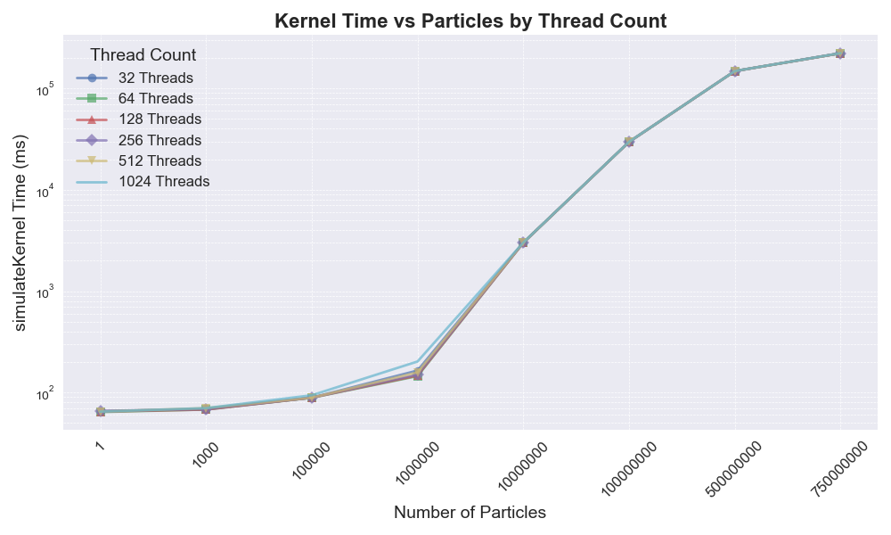
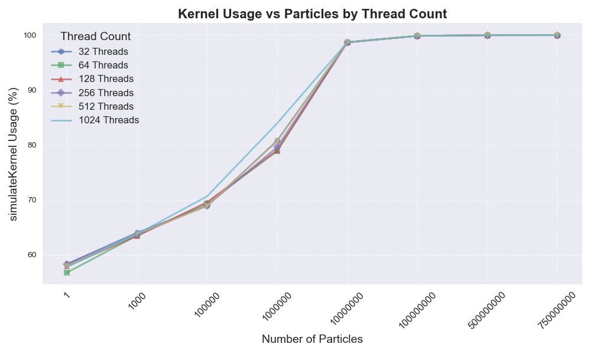
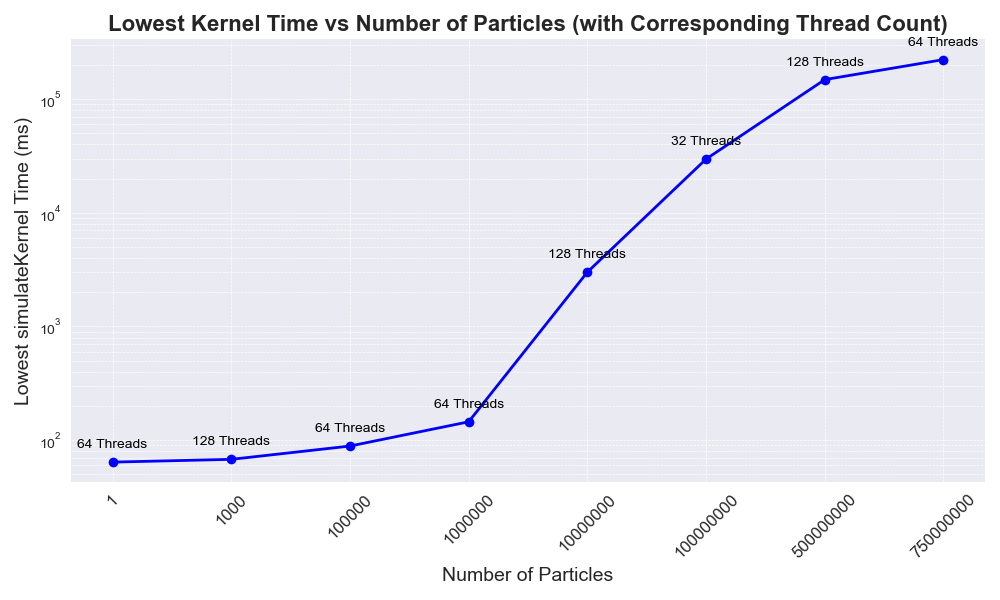
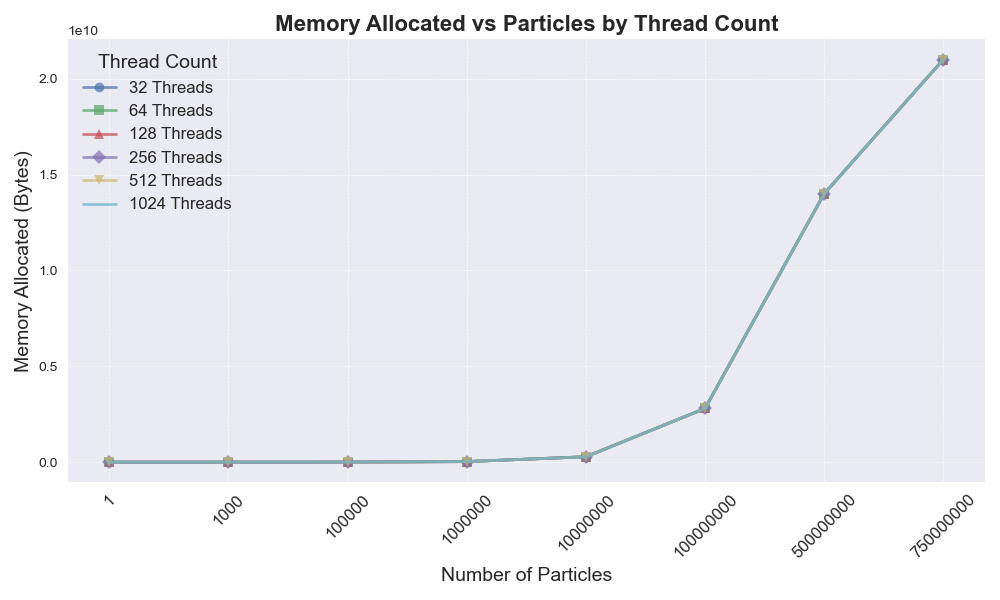
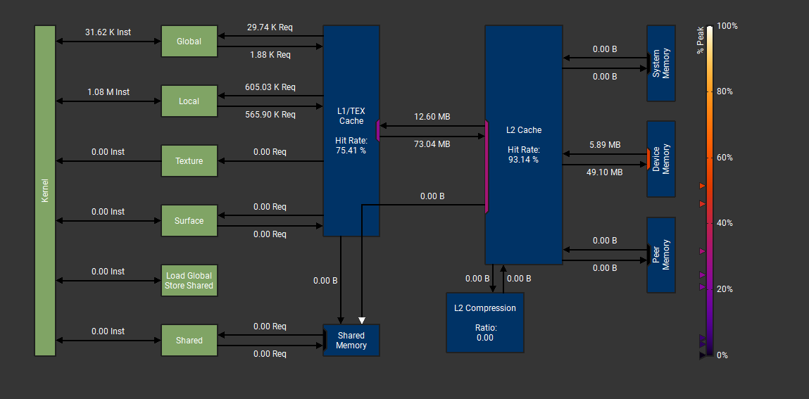
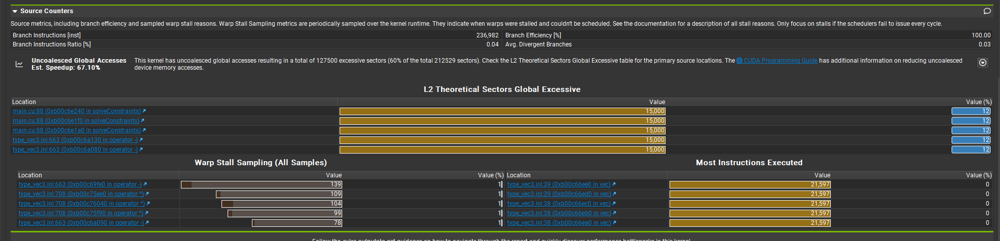

# CUDA Point-Plane Collisions
The goal of this is to maximize the number of particles possible in a physics simulation with 6 plane checks.

# Linux
## Dependencies
For code that is run on the Linux machine for access to a 4090, this is what was necessary:

1. To get the VM CUDA to run, append
```sh
export PATH=/usr/local/cuda-11.7/bin$PATH
```
to `~/.profile` and `source ~/.bashrc`. To know it works, run `nvcc --version`.

2. Install GLM somewhere - I added an environment variable `export GLM_INCLUDE_DIR=~/packages/glm` to my `.profile` and got the code from [here](https://github.com/g-truc/glm/tree/master). Feel free to just modify `CMakeLists.txt` to point to your glm installation if its local to the project, or elsewhere.
3. `CMakeLists.txt` needed to be modified to find the header files in `/usr/` using [this](https://stackoverflow.com/questions/13167598/error-cuda-runtime-h-no-such-file-or-directory/75559127#75559127).
4. To run `ncu` meaningfully, you need root access. https://developer.nvidia.com/nvidia-development-tools-solutions-err_nvgpuctrperm-permission-issue-performance-counters

## Helpful Commands
- `cat /etc/os-release` shows the distro and device architecture.
- `nvidia-smi` provides GPU information (assuming it is a NVIDIA gpu).
- `ncu --target-processes all -o <report name> <executable> [args]` will generate a compute report over all kernels given some executable and its args. 

## Notes
1. Benchmarks run on **NVIDIA GeForce RTX 4090** with **CUDA 12.2** 
2. The program was refactored to correct issue as well as new logic to evaluate until it "converges" with the last particle velocity reaches a nonzero threshold $\approx 0$. This is possible with a cudaMemcpy of `sizeof(uint32_t)`, which is assumed to be a very minimal cost per cycle, and an `atomicAdd` to a counter of "dead particles".
3. The original timestep (`#define DT_SIMULATION (1.0f / 20.0f)`) was updated to `(1 / 60.0f)` or once every second. That is a pretty smooth DT value.
   1. Regarding the speed at which the simulation "converges" even for `n=1` that is a subjective rate based on my modeling.
4. Thread size and particle size vary and are tested as hyperparameters. Block size is according to the following:
   ```cpp
    size_t problem_sz = g_particles.h_maxParticles;
    g_blocksPerGrid = (problem_sz + g_threadsPerBlock.x - 1) / g_threadsPerBlock.x;
    ```
5. `results/cout/{particle count}/...` is where you can find the results for a given particle.
6. Memory:
   1. Global Space (~25 GB, of which only ~70 MB is storable in L2 cache)
      1. I am allocating `vec3 pos`, `vec3 vel`, and `float radius`, which is $$2 * sizeof(vec3) + sizeof(float) = 28 \text{ bytes per particle}$$
      2. The **theoretical limit** to particle allocations on the GPU was just under **1 billion** particles: $$\frac{\text{device memory}}{sizeof(\text{particle})} = \frac{25393692672 \text{ bytes}}{28 \text{ bytes}} \approx 906917595 \text{ particles}$$ That said, out of concern for potential margin of error (and other users...), I made the upper bound `7,500,000` particles. My maximum allocation was **20.4GB**.
      3. There are of course some other overhead allocations, i.e. `d_deadParticles` (isn't ideal for global, but can't be in `__constant__`) either.
   2. Constant Space (~64 KB, cached in L1)
      1. I allocated 4 `__constant__` members due to their constant nature, and frequent or "hot" use across all particles for collision checks and whatever else. These were `size_t d_maxParticles`, `size_t d_numPlanes`, `vec3 d_planeP[6]`, and `vec3 d_planeN[6]`.
      2. These may seem small, but GPU constant space is very limited, around about **64 KB**.
7. NCU Concerns
   1. It is clear that while global accesses are necessary in this case, compute reports **60%** excessive sectors - more memory is transferred than needed by the thread. For example look at this function:
    
    ```cpp
    __device__ void solveConstraints(int idx, const glm::vec3* pos, const glm::vec3* vel, const float* radii, 
                                 glm::vec3& x_new, glm::vec3& v_new, float& dt, const glm::vec3& a) {
    // Avoid at rest particles otherwise our counter will be inaccurate
    if (glm::length(v_new) < STOP_VELOCITY) {
        return;
    }

    // Plane Collisions //
    for (int i = 0; i < d_numPlanes; i++) {
        const glm::vec3& p(d_planeP[i]), n(d_planeN[i]);
        const glm::vec3& x(pos[idx]), v(vel[idx]); // FIXME: UNCOALESCED GLOBAL ACCESS (UNNECESSARY IN LOOP)

        glm::vec3 new_p = p + (radii[idx] * n);
        ...
    }
    ```
    - It is not necessary to make a retrieval from global memory 6 times per plane for the same position.
    - Even though we only ask for 12 bytes of our float3, memory boundaries will chunk global memory into sectors, which are usually ~32 bytes per chunk. The data is then retrieved in sectors, meaning when we ask for pos[0], we are perhaps getting pos[1], and **some** of pos[2].
    - The reason **some** of pos[2] is problematic is that we now have to do an entirely additional fetch for just 4 bytes of pos[2]. Therefore, it is ideal to align your "object" into even chunks of the sector size.
## Improvements
1. Padding was added, moving `vec3` to `vec4` for both pos and vel. This update brought $sizeof(\text{particle}) = 2 * sizeof(\text{vec4}) + sizeof(\text{float}) = 28$.
   1. This was done due to the uncoalesced global memory access, which was a major bottleneck. The idea was that sector size, at 32 bytes, is better stored with two vec4s, meaning no request would ever need to use another fetch request or cycle to get the necessary memory. 
2. Any redundant fetches from global memory were refactored
   1. `const glm::vec3& x(pos[idx]), v(vel[idx]);` was moved outside of the loop iterating 6 times per `solveConstraints` iteration. This doesn't sound like a lot, but when it happens 5 times too many for each particle, it scales quickly.
3. For the most part, the results of this were nonexistent. I would like to run more conclusive tests.
## Plots & Images





